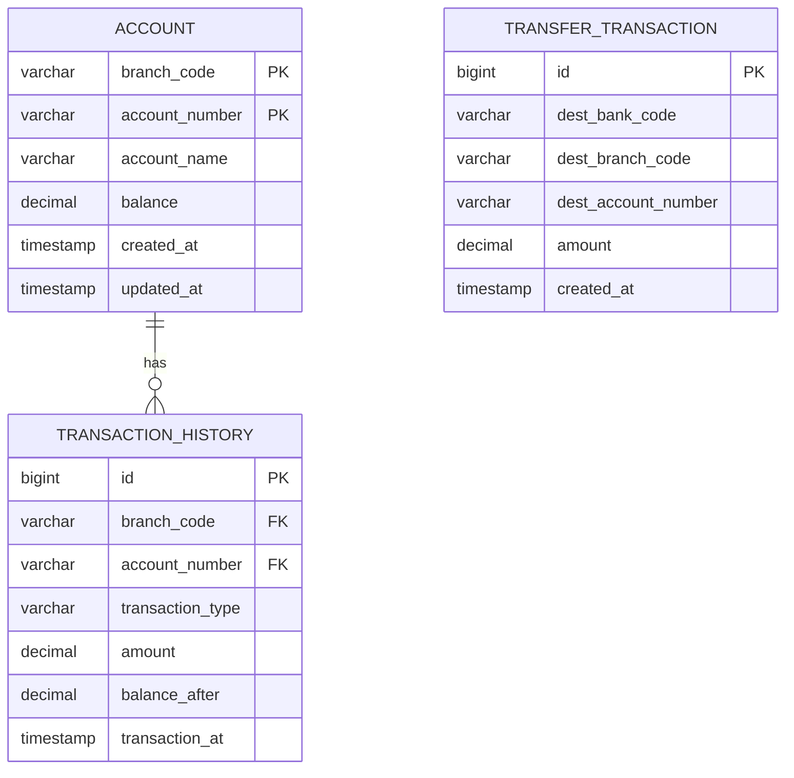

# 銀行口座管理APIアプリケーション 設計書

## 1. システム概要

### 1.1 目的
銀行口座の管理および他行連携機能を提供するREST APIアプリケーション

### 1.2 技術スタック
- **言語**: Java 21
- **アプリケーションサーバー**: OpenLiberty
- **フレームワーク**: Jakarta EE 10 (JAX-RS, JPA, CDI)
- **データベース**: PostgreSQL
- **ビルドツール**: Maven
- **コンテナ**: Docker

### 1.3 設計方針
- Springを使用せず、Jakarta EE標準機能のみで実装
- シンプルな3層アーキテクチャ（REST層、サービス層、DAO層）
- テストコードは作成しない
- JSON形式での入出力
- 統一されたエラーハンドリング

---

## 2. アーキテクチャ設計

### 2.1 レイヤー構成

```
┌─────────────────────────────────────┐
│     REST API Layer (JAX-RS)         │
│  - AccountResource                  │
│  - TransferResource                 │
│  - ExceptionMapper                  │
└─────────────────────────────────────┘
              ↓
┌─────────────────────────────────────┐
│      Service Layer (CDI)            │
│  - AccountService                   │
│  - TransferService                  │
└─────────────────────────────────────┘
              ↓
┌─────────────────────────────────────┐
│       DAO Layer (JPA)               │
│  - AccountDao                       │
│  - TransactionHistoryDao            │
│  - TransferTransactionDao           │
└─────────────────────────────────────┘
              ↓
┌─────────────────────────────────────┐
│      Database (PostgreSQL)          │
│  - account                          │
│  - transaction_history              │
│  - transfer_transaction             │
└─────────────────────────────────────┘
```

### 2.2 パッケージ構成

```
jp.sample
├── rest                    # REST APIエンドポイント
│   ├── RestApplication.java
│   ├── AccountResource.java
│   ├── TransferResource.java
│   └── mapper
│       └── ApplicationExceptionMapper.java
├── service                 # ビジネスロジック
│   ├── AccountService.java
│   └── TransferService.java
├── dao                     # データアクセス
│   ├── AccountDao.java
│   ├── TransactionHistoryDao.java
│   └── TransferTransactionDao.java
├── entity                  # JPAエンティティ
│   ├── Account.java
│   ├── TransactionHistory.java
│   └── TransferTransaction.java
├── dto                     # データ転送オブジェクト
│   ├── request
│   │   ├── AccountRequest.java
│   │   ├── DepositRequest.java
│   │   ├── WithdrawRequest.java
│   │   └── TransferRequest.java
│   └── response
│       ├── AccountResponse.java
│       ├── StatusResponse.java
│       └── ErrorResponse.java
└── exception               # カスタム例外
    ├── ApplicationException.java
    └── AccountNotFoundException.java
```

---

## 3. データベース設計

### 3.1 ER図



### 3.2 テーブル定義

#### 3.2.1 口座テーブル (account)

| カラム名 | データ型 | NULL | キー | 説明 |
|---------|---------|------|------|------|
| branch_code | VARCHAR(3) | NOT NULL | PK | 支店番号 |
| account_number | VARCHAR(7) | NOT NULL | PK | 口座番号 |
| account_name | VARCHAR(100) | NOT NULL | - | 口座名義 |
| balance | DECIMAL(15,2) | NOT NULL | - | 残高 |
| created_at | TIMESTAMP | NOT NULL | - | 作成日時 |
| updated_at | TIMESTAMP | NOT NULL | - | 更新日時 |

**制約**:
- PRIMARY KEY: (branch_code, account_number)
- balance >= 0 (CHECK制約)

#### 3.2.2 入出金履歴テーブル (transaction_history)

| カラム名 | データ型 | NULL | キー | 説明 |
|---------|---------|------|------|------|
| id | BIGSERIAL | NOT NULL | PK | 履歴ID |
| branch_code | VARCHAR(3) | NOT NULL | FK | 支店番号 |
| account_number | VARCHAR(7) | NOT NULL | FK | 口座番号 |
| transaction_type | VARCHAR(10) | NOT NULL | - | 取引種別(DEPOSIT/WITHDRAW) |
| amount | DECIMAL(15,2) | NOT NULL | - | 取引金額 |
| balance_after | DECIMAL(15,2) | NOT NULL | - | 取引後残高 |
| transaction_at | TIMESTAMP | NOT NULL | - | 取引日時 |

**制約**:
- PRIMARY KEY: id
- FOREIGN KEY: (branch_code, account_number) REFERENCES account
- transaction_type IN ('DEPOSIT', 'WITHDRAW')

#### 3.2.3 振込トランザクションテーブル (transfer_transaction)

| カラム名 | データ型 | NULL | キー | 説明 |
|---------|---------|------|------|------|
| id | BIGSERIAL | NOT NULL | PK | トランザクションID |
| dest_bank_code | VARCHAR(4) | NOT NULL | - | 宛先銀行コード |
| dest_branch_code | VARCHAR(3) | NOT NULL | - | 宛先支店番号 |
| dest_account_number | VARCHAR(7) | NOT NULL | - | 宛先口座番号 |
| amount | DECIMAL(15,2) | NOT NULL | - | 振込金額 |
| created_at | TIMESTAMP | NOT NULL | - | 作成日時 |

**制約**:
- PRIMARY KEY: id
- amount > 0 (CHECK制約)

---

## 4. API設計

### 4.1 共通仕様

#### 4.1.1 ベースURL
```
http://localhost:9080/api-proc/api
```

#### 4.1.2 リクエスト/レスポンス形式
- Content-Type: `application/json`
- Accept: `application/json`

#### 4.1.3 エラーレスポンス形式
```json
{
  "errorCode": "0001",
  "errorMessage": "エラーの詳細メッセージ"
}
```

#### 4.1.4 HTTPステータスコード
- 200: 成功
- 400: リクエストエラー
- 404: リソースが見つからない
- 500: サーバーエラー

### 4.2 口座機能API

#### 4.2.1 口座情報取得API

**エンドポイント**: `GET /accounts`

**リクエストパラメータ**:
```json
{
  "branchCode": "001",
  "accountNumber": "1234567"
}
```

**レスポンス** (200 OK):
```json
{
  "branchCode": "001",
  "accountNumber": "1234567",
  "accountName": "山田太郎",
  "balance": 1000000.00,
  "transactionHistories": [
    {
      "transactionDate": "2026-03-01",
      "amount": 100000,
      "comment": "入金"
    },
    {
      "transactionDate": "2026-02-28",
      "amount": -50000,
      "comment": "出金"
    }
  ]
}
```

| フィールド名 | 型 | 説明 |
|---|---|---|
| `branchCode` | string | 支店番号 |
| `accountNumber` | string | 口座番号 |
| `accountName` | string | 口座名義 |
| `balance` | number | 残高 |
| `transactionHistories` | array | 入出金履歴リスト |

**transactionHistories 要素**

| フィールド名 | 型 | 説明 |
|---|---|---|
| `transactionDate` | string | 取引日付（YYYY-MM-DD形式） |
| `amount` | number | 入出金額（入金はプラス、出金はマイナス） |
| `comment` | string | コメント（取引種別: 入金 / 出金） |

**エラーレスポンス** (404 Not Found):
```json
{
  "errorCode": "0001",
  "errorMessage": "指定された口座が見つかりません"
}
```

#### 4.2.2 入金API

**エンドポイント**: `POST /accounts/deposit`

**リクエストボディ**:
```json
{
  "branchCode": "001",
  "accountNumber": "1234567",
  "amount": 50000.00
}
```

**レスポンス** (200 OK):
```json
{
  "status": 0
}
```

**エラーレスポンス** (404 Not Found):
```json
{
  "errorCode": "0001",
  "errorMessage": "指定された口座が見つかりません"
}
```

**エラーレスポンス** (400 Bad Request):
```json
{
  "errorCode": "0002",
  "errorMessage": "入金額は正の数である必要があります"
}
```

**業務ルール**:
- 入金額は正の数（> 0）である必要があります
- 入金処理は以下の順序で実行されます：
  1. 口座の存在確認
  2. 入金額の妥当性チェック（正の数）
  3. 口座残高の更新（残高 + 入金額）
  4. 入出金履歴への記録

#### 4.2.3 出金API

**エンドポイント**: `POST /accounts/withdraw`

**リクエストボディ**:
```json
{
  "branchCode": "001",
  "accountNumber": "1234567",
  "amount": 30000.00
}
```

**レスポンス** (200 OK):
```json
{
  "status": 0
}
```

**エラーレスポンス** (404 Not Found):
```json
{
  "errorCode": "0001",
  "errorMessage": "指定された口座が見つかりません"
}
```

**エラーレスポンス** (400 Bad Request - 残高不足):
```json
{
  "errorCode": "0003",
  "errorMessage": "残高不足です。現在残高: 10000.00円、出金額: 30000.00円"
}
```

**エラーレスポンス** (400 Bad Request - 不正な金額):
```json
{
  "errorCode": "0006",
  "errorMessage": "出金額は正の数である必要があります"
}
```

**業務ルール**:
- 出金額は正の数（> 0）である必要があります
- 出金後の残高が0円以上である必要があります（残高 >= 出金額）
- 残高不足の場合、現在残高と出金額をエラーメッセージに含めます
- 出金処理は以下の順序で実行されます：
  1. 口座の存在確認
  2. 出金額の妥当性チェック（正の数）
  3. 残高不足チェック（現在残高 >= 出金額）
  4. 口座残高の更新（残高 - 出金額）
  5. 入出金履歴への記録

### 4.3 他行連携機能API

#### 4.3.1 振込トランザクション作成API

**エンドポイント**: `POST /transfers`

**リクエストボディ**:
```json
{
  "destBankCode": "0001",
  "destBranchCode": "002",
  "destAccountNumber": "7654321",
  "amount": 100000.00
}
```

**レスポンス** (200 OK):
```json
{
  "status": 0
}
```

**エラーレスポンス** (400 Bad Request):
```json
{
  "errorCode": "0004",
  "errorMessage": "振込金額は正の数である必要があります"
}
```

**業務ルール**:
- 振込金額は正の数（> 0）である必要があります
- 振込トランザクション作成処理は以下の順序で実行されます：
  1. 振込金額の妥当性チェック（正の数）
  2. 振込トランザクションレコードの作成
- 注意：このAPIは振込トランザクションの作成のみを行い、実際の口座間の資金移動は行いません

---

## 5. エラーコード一覧

| エラーコード | HTTPステータス | 説明 | 使用API |
|------------|--------------|------|---------|
| 0001 | 404 | 指定された口座が見つかりません | 口座情報取得、入金、出金 |
| 0002 | 400 | 入金額は正の数である必要があります | 入金 |
| 0003 | 400 | 残高不足です（現在残高と出金額を含む） | 出金 |
| 0004 | 400 | 振込金額は正の数である必要があります | 振込トランザクション作成 |
| 0005 | 400 | 必須パラメータが不足しています | 全API |
| 0006 | 400 | 出金額は正の数である必要があります | 出金 |
| 9999 | 500 | システムエラーが発生しました | 全API |

**エラーメッセージ詳細**:
- **0003 (残高不足)**: エラーメッセージに現在残高と出金額を含めます
  - 例: "残高不足です。現在残高: 10000.00円、出金額: 30000.00円"

---

## 6. クラス設計

### 6.1 エンティティクラス

#### 6.1.1 Account.java
```java
@Entity
@Table(name = "account")
@IdClass(AccountId.class)
public class Account {
    @Id
    @Column(name = "branch_code", length = 3)
    private String branchCode;
    
    @Id
    @Column(name = "account_number", length = 7)
    private String accountNumber;
    
    @Column(name = "account_name", length = 100, nullable = false)
    private String accountName;
    
    @Column(name = "balance", precision = 15, scale = 2, nullable = false)
    private BigDecimal balance;
    
    @Column(name = "created_at", nullable = false)
    private LocalDateTime createdAt;
    
    @Column(name = "updated_at", nullable = false)
    private LocalDateTime updatedAt;
}
```

#### 6.1.2 TransactionHistory.java
```java
@Entity
@Table(name = "transaction_history")
public class TransactionHistory {
    @Id
    @GeneratedValue(strategy = GenerationType.IDENTITY)
    private Long id;
    
    @Column(name = "branch_code", length = 3, nullable = false)
    private String branchCode;
    
    @Column(name = "account_number", length = 7, nullable = false)
    private String accountNumber;
    
    @Column(name = "transaction_type", length = 10, nullable = false)
    private String transactionType;
    
    @Column(name = "amount", precision = 15, scale = 2, nullable = false)
    private BigDecimal amount;
    
    @Column(name = "balance_after", precision = 15, scale = 2, nullable = false)
    private BigDecimal balanceAfter;
    
    @Column(name = "transaction_at", nullable = false)
    private LocalDateTime transactionAt;
}
```

#### 6.1.3 TransferTransaction.java
```java
@Entity
@Table(name = "transfer_transaction")
public class TransferTransaction {
    @Id
    @GeneratedValue(strategy = GenerationType.IDENTITY)
    private Long id;
    
    @Column(name = "dest_bank_code", length = 4, nullable = false)
    private String destBankCode;
    
    @Column(name = "dest_branch_code", length = 3, nullable = false)
    private String destBranchCode;
    
    @Column(name = "dest_account_number", length = 7, nullable = false)
    private String destAccountNumber;
    
    @Column(name = "amount", precision = 15, scale = 2, nullable = false)
    private BigDecimal amount;
    
    @Column(name = "created_at", nullable = false)
    private LocalDateTime createdAt;
}
```

### 6.2 DAOクラス

#### 6.2.1 AccountDao.java
```java
@ApplicationScoped
public class AccountDao {
    @PersistenceContext
    private EntityManager em;
    
    public Optional<Account> findByBranchAndAccount(String branchCode, String accountNumber);
    public void update(Account account);
}
```

#### 6.2.2 TransactionHistoryDao.java
```java
@ApplicationScoped
public class TransactionHistoryDao {
    @PersistenceContext
    private EntityManager em;
    
    public void create(TransactionHistory history);
    public List<TransactionHistory> findByBranchAndAccount(String branchCode, String accountNumber);
}
```

#### 6.2.3 TransferTransactionDao.java
```java
@ApplicationScoped
public class TransferTransactionDao {
    @PersistenceContext
    private EntityManager em;
    
    public void create(TransferTransaction transaction);
}
```

### 6.3 DTOクラス

#### 6.3.1 TransactionHistoryDto.java
```java
public class TransactionHistoryDto {
    private String transactionDate;  // 取引日付（YYYY-MM-DD形式）
    private BigDecimal amount;       // 入出金額（入金はプラス、出金はマイナス）
    private String comment;          // コメント（取引種別: 入金 / 出金）
}
```

#### 6.3.2 AccountResponse.java（更新）
```java
public class AccountResponse {
    private String branchCode;
    private String accountNumber;
    private String accountName;
    private BigDecimal balance;
    private List<TransactionHistoryDto> transactionHistories;
}
```

### 6.4 サービスクラス

#### 6.4.1 AccountService.java
```java
@ApplicationScoped
@Transactional
public class AccountService {
    @Inject
    private AccountDao accountDao;
    
    @Inject
    private TransactionHistoryDao historyDao;
    
    public AccountResponse getAccount(String branchCode, String accountNumber);
    public void deposit(String branchCode, String accountNumber, BigDecimal amount);
    public void withdraw(String branchCode, String accountNumber, BigDecimal amount);
}
```

#### 6.3.2 TransferService.java
```java
@ApplicationScoped
@Transactional
public class TransferService {
    @Inject
    private TransferTransactionDao transferDao;
    
    public void createTransfer(String destBankCode, String destBranchCode, 
                              String destAccountNumber, BigDecimal amount);
}
```

### 6.4 RESTリソースクラス

#### 6.4.1 AccountResource.java
```java
@Path("/accounts")
@Produces(MediaType.APPLICATION_JSON)
@Consumes(MediaType.APPLICATION_JSON)
@ApplicationScoped
public class AccountResource {
    @Inject
    private AccountService accountService;
    
    @GET
    public Response getAccount(@QueryParam("branchCode") String branchCode,
                              @QueryParam("accountNumber") String accountNumber);
    
    @POST
    @Path("/deposit")
    public Response deposit(DepositRequest request);
    
    @POST
    @Path("/withdraw")
    public Response withdraw(WithdrawRequest request);
}
```

#### 6.4.2 TransferResource.java
```java
@Path("/transfers")
@Produces(MediaType.APPLICATION_JSON)
@Consumes(MediaType.APPLICATION_JSON)
@ApplicationScoped
public class TransferResource {
    @Inject
    private TransferService transferService;
    
    @POST
    public Response createTransfer(TransferRequest request);
}
```

---

## 7. データベース接続設定

### 7.1 persistence.xml
```xml
<persistence-unit name="bankPU" transaction-type="JTA">
    <jta-data-source>jdbc/bankDB</jta-data-source>
    <properties>
        <property name="jakarta.persistence.schema-generation.database.action" value="none"/>
    </properties>
</persistence-unit>
```

### 7.2 server.xml (追加設定)
```xml
<library id="postgresql-lib">
    <fileset dir="${shared.resource.dir}/postgresql" includes="*.jar"/>
</library>

<dataSource id="bankDB" jndiName="jdbc/bankDB">
    <jdbcDriver libraryRef="postgresql-lib"/>
    <properties.postgresql 
        serverName="${env.DB_HOST}"
        portNumber="${env.DB_PORT}"
        databaseName="${env.DB_NAME}"
        user="${env.DB_USER}"
        password="${env.DB_PASSWORD}"/>
</dataSource>
```

---

## 8. Docker環境設定

### 8.1 docker-compose.yml
```yaml
version: '3.8'

services:
  postgres:
    image: postgres:16
    environment:
      POSTGRES_DB: bankdb
      POSTGRES_USER: bankuser
      POSTGRES_PASSWORD: bankpass
    ports:
      - "5432:5432"
    volumes:
      - postgres-data:/var/lib/postgresql/data
      - ./db/init:/docker-entrypoint-initdb.d

  app:
    build: .
    ports:
      - "9080:9080"
      - "9443:9443"
    environment:
      DB_HOST: postgres
      DB_PORT: 5432
      DB_NAME: bankdb
      DB_USER: bankuser
      DB_PASSWORD: bankpass
    depends_on:
      - postgres

volumes:
  postgres-data:
```

### 8.2 ローカル開発環境
Windows環境でローカル実行する場合:
1. PostgreSQLをローカルインストール
2. 環境変数を設定
3. `mvnw liberty:dev` で起動

---

## 9. ビルド・デプロイ手順

### 9.1 ローカル開発
```bash
# Mavenビルド
mvnw clean package

# OpenLiberty起動（開発モード）
mvnw liberty:dev
```

### 9.2 Docker環境
```bash
# イメージビルド
docker-compose build

# コンテナ起動
docker-compose up -d

# ログ確認
docker-compose logs -f app
```

---

## 10. テストデータ

### 10.1 初期データ投入SQL
```sql
-- 口座データ
INSERT INTO account (branch_code, account_number, account_name, balance, created_at, updated_at)
VALUES 
('001', '1234567', '山田太郎', 1000000.00, CURRENT_TIMESTAMP, CURRENT_TIMESTAMP),
('001', '2345678', '佐藤花子', 500000.00, CURRENT_TIMESTAMP, CURRENT_TIMESTAMP),
('002', '3456789', '鈴木一郎', 2000000.00, CURRENT_TIMESTAMP, CURRENT_TIMESTAMP);
```

---

## 11. 実装順序

1. データベース設計・DDL作成
2. エンティティクラス実装
3. DAOクラス実装
4. サービスクラス実装
5. DTOクラス実装
6. RESTリソースクラス実装
7. エラーハンドリング実装
8. データベース接続設定
9. Docker環境構築
10. 動作確認

---

## 12. 補足事項

### 12.1 トランザクション管理
- `@Transactional`アノテーションでサービス層のメソッドをトランザクション管理
- JTAトランザクションを使用

### 12.2 バリデーション
- 入力値の妥当性チェックはサービス層で実施
- 金額は正の数であることを確認
- 残高不足チェックを実施

### 12.3 ログ出力
- Jakarta EEの標準ロギング機能を使用
- エラー発生時は詳細をログ出力

### 12.4 セキュリティ
- 本設計では認証・認可は実装しない（将来拡張可能）
- SQLインジェクション対策としてJPAのパラメータバインドを使用

---

## 13. DDLスクリプト

### 13.1 テーブル作成SQL (db/init/01_create_tables.sql)

```sql
-- ============================================
-- 銀行口座管理システム DDL
-- ============================================

-- 口座テーブル
CREATE TABLE account (
    branch_code VARCHAR(3) NOT NULL,
    account_number VARCHAR(7) NOT NULL,
    account_name VARCHAR(100) NOT NULL,
    balance DECIMAL(15, 2) NOT NULL,
    created_at TIMESTAMP NOT NULL DEFAULT CURRENT_TIMESTAMP,
    updated_at TIMESTAMP NOT NULL DEFAULT CURRENT_TIMESTAMP,
    CONSTRAINT pk_account PRIMARY KEY (branch_code, account_number),
    CONSTRAINT chk_balance CHECK (balance >= 0)
);

COMMENT ON TABLE account IS '口座テーブル';
COMMENT ON COLUMN account.branch_code IS '支店番号';
COMMENT ON COLUMN account.account_number IS '口座番号';
COMMENT ON COLUMN account.account_name IS '口座名義';
COMMENT ON COLUMN account.balance IS '残高';
COMMENT ON COLUMN account.created_at IS '作成日時';
COMMENT ON COLUMN account.updated_at IS '更新日時';

-- 入出金履歴テーブル
CREATE TABLE transaction_history (
    id BIGSERIAL NOT NULL,
    branch_code VARCHAR(3) NOT NULL,
    account_number VARCHAR(7) NOT NULL,
    transaction_type VARCHAR(10) NOT NULL,
    amount DECIMAL(15, 2) NOT NULL,
    balance_after DECIMAL(15, 2) NOT NULL,
    transaction_at TIMESTAMP NOT NULL DEFAULT CURRENT_TIMESTAMP,
    CONSTRAINT pk_transaction_history PRIMARY KEY (id),
    CONSTRAINT fk_transaction_account FOREIGN KEY (branch_code, account_number) 
        REFERENCES account(branch_code, account_number),
    CONSTRAINT chk_transaction_type CHECK (transaction_type IN ('DEPOSIT', 'WITHDRAW'))
);

COMMENT ON TABLE transaction_history IS '入出金履歴テーブル';
COMMENT ON COLUMN transaction_history.id IS '履歴ID';
COMMENT ON COLUMN transaction_history.branch_code IS '支店番号';
COMMENT ON COLUMN transaction_history.account_number IS '口座番号';
COMMENT ON COLUMN transaction_history.transaction_type IS '取引種別(DEPOSIT:入金/WITHDRAW:出金)';
COMMENT ON COLUMN transaction_history.amount IS '取引金額';
COMMENT ON COLUMN transaction_history.balance_after IS '取引後残高';
COMMENT ON COLUMN transaction_history.transaction_at IS '取引日時';

-- インデックス作成
CREATE INDEX idx_transaction_history_account ON transaction_history(branch_code, account_number);
CREATE INDEX idx_transaction_history_date ON transaction_history(transaction_at);

-- 振込トランザクションテーブル
CREATE TABLE transfer_transaction (
    id BIGSERIAL NOT NULL,
    dest_bank_code VARCHAR(4) NOT NULL,
    dest_branch_code VARCHAR(3) NOT NULL,
    dest_account_number VARCHAR(7) NOT NULL,
    amount DECIMAL(15, 2) NOT NULL,
    created_at TIMESTAMP NOT NULL DEFAULT CURRENT_TIMESTAMP,
    CONSTRAINT pk_transfer_transaction PRIMARY KEY (id),
    CONSTRAINT chk_transfer_amount CHECK (amount > 0)
);

COMMENT ON TABLE transfer_transaction IS '振込トランザクションテーブル';
COMMENT ON COLUMN transfer_transaction.id IS 'トランザクションID';
COMMENT ON COLUMN transfer_transaction.dest_bank_code IS '宛先銀行コード';
COMMENT ON COLUMN transfer_transaction.dest_branch_code IS '宛先支店番号';
COMMENT ON COLUMN transfer_transaction.dest_account_number IS '宛先口座番号';
COMMENT ON COLUMN transfer_transaction.amount IS '振込金額';
COMMENT ON COLUMN transfer_transaction.created_at IS '作成日時';

-- インデックス作成
CREATE INDEX idx_transfer_transaction_date ON transfer_transaction(created_at);
```

### 13.2 初期データ投入SQL (db/init/02_insert_data.sql)

```sql
-- ============================================
-- テストデータ投入
-- ============================================

-- 口座データ
INSERT INTO account (branch_code, account_number, account_name, balance, created_at, updated_at)
VALUES 
    ('001', '1234567', '山田太郎', 1000000.00, CURRENT_TIMESTAMP, CURRENT_TIMESTAMP),
    ('001', '2345678', '佐藤花子', 500000.00, CURRENT_TIMESTAMP, CURRENT_TIMESTAMP),
    ('002', '3456789', '鈴木一郎', 2000000.00, CURRENT_TIMESTAMP, CURRENT_TIMESTAMP),
    ('002', '4567890', '田中美咲', 750000.00, CURRENT_TIMESTAMP, CURRENT_TIMESTAMP),
    ('003', '5678901', '高橋健太', 1500000.00, CURRENT_TIMESTAMP, CURRENT_TIMESTAMP);

-- 入出金履歴データ（サンプル）
INSERT INTO transaction_history (branch_code, account_number, transaction_type, amount, balance_after, transaction_at)
VALUES 
    ('001', '1234567', 'DEPOSIT', 100000.00, 1000000.00, CURRENT_TIMESTAMP - INTERVAL '1 day'),
    ('001', '2345678', 'DEPOSIT', 500000.00, 500000.00, CURRENT_TIMESTAMP - INTERVAL '2 days'),
    ('002', '3456789', 'WITHDRAW', 50000.00, 2000000.00, CURRENT_TIMESTAMP - INTERVAL '3 days');
```

---

## 14. 設定ファイル詳細

### 14.1 persistence.xml (src/main/resources/META-INF/persistence.xml)

```xml
<?xml version="1.0" encoding="UTF-8"?>
<persistence xmlns="https://jakarta.ee/xml/ns/persistence"
             xmlns:xsi="http://www.w3.org/2001/XMLSchema-instance"
             xsi:schemaLocation="https://jakarta.ee/xml/ns/persistence 
                                 https://jakarta.ee/xml/ns/persistence/persistence_3_0.xsd"
             version="3.0">
    
    <persistence-unit name="bankPU" transaction-type="JTA">
        <jta-data-source>jdbc/bankDB</jta-data-source>
        
        <!-- エンティティクラス -->
        <class>jp.sample.entity.Account</class>
        <class>jp.sample.entity.TransactionHistory</class>
        <class>jp.sample.entity.TransferTransaction</class>
        
        <properties>
            <!-- スキーマ生成は手動DDLで行うため無効化 -->
            <property name="jakarta.persistence.schema-generation.database.action" value="none"/>
            
            <!-- ログ設定 -->
            <property name="eclipselink.logging.level" value="FINE"/>
            <property name="eclipselink.logging.parameters" value="true"/>
        </properties>
    </persistence-unit>
</persistence>
```

### 14.2 server.xml 更新内容

既存の[`server.xml`](../src/main/liberty/config/server.xml:1)に以下を追加:

```xml
<?xml version="1.0" encoding="UTF-8"?>
<server description="Bank API Server">

    <!-- Enable features -->
    <featureManager>
        <feature>jakartaee-10.0</feature>
    </featureManager>

    <!-- PostgreSQL JDBCドライバライブラリ -->
    <library id="postgresql-lib">
        <fileset dir="${shared.resource.dir}/postgresql" includes="*.jar"/>
    </library>

    <!-- データソース設定 -->
    <dataSource id="bankDB" jndiName="jdbc/bankDB">
        <jdbcDriver libraryRef="postgresql-lib"/>
        <properties.postgresql 
            serverName="${env.DB_HOST}"
            portNumber="${env.DB_PORT}"
            databaseName="${env.DB_NAME}"
            user="${env.DB_USER}"
            password="${env.DB_PASSWORD}"/>
        <connectionManager maxPoolSize="10" minPoolSize="2"/>
    </dataSource>

    <!-- HTTPエンドポイント -->
    <httpEndpoint id="defaultHttpEndpoint"
                  host="*"
                  httpPort="9080"
                  httpsPort="9443" />

    <!-- アプリケーション自動展開 -->
    <applicationManager autoExpand="true"/>

    <!-- Webアプリケーション設定 -->
    <webApplication contextRoot="/api-proc" location="api-proc.war" />

    <!-- SSL設定 -->
    <ssl id="defaultSSLConfig" trustDefaultCerts="true" />
    
    <!-- ログ設定 -->
    <logging consoleLogLevel="INFO" 
             traceSpecification="*=info:jp.sample.*=fine"/>
</server>
```

### 14.3 docker-compose.yml

```yaml
version: '3.8'

services:
  # PostgreSQLデータベース
  postgres:
    image: postgres:16-alpine
    container_name: bank-postgres
    environment:
      POSTGRES_DB: bankdb
      POSTGRES_USER: bankuser
      POSTGRES_PASSWORD: bankpass
      TZ: Asia/Tokyo
    ports:
      - "5432:5432"
    volumes:
      - postgres-data:/var/lib/postgresql/data
      - ./db/init:/docker-entrypoint-initdb.d
    healthcheck:
      test: ["CMD-SHELL", "pg_isready -U bankuser -d bankdb"]
      interval: 10s
      timeout: 5s
      retries: 5

  # OpenLibertyアプリケーション
  app:
    build: .
    container_name: bank-api
    ports:
      - "9080:9080"
      - "9443:9443"
    environment:
      DB_HOST: postgres
      DB_PORT: 5432
      DB_NAME: bankdb
      DB_USER: bankuser
      DB_PASSWORD: bankpass
      TZ: Asia/Tokyo
    depends_on:
      postgres:
        condition: service_healthy
    volumes:
      - ./src/main/liberty/config:/config
      - ./target/api-proc.war:/config/apps/api-proc.war

volumes:
  postgres-data:
    driver: local
```

### 14.4 Dockerfile 更新

```dockerfile
FROM icr.io/appcafe/open-liberty:kernel-slim-java21-openj9-ubi-minimal

# PostgreSQL JDBCドライバのコピー
COPY --chown=1001:0 ./lib/postgresql-42.7.1.jar /opt/ol/wlp/usr/shared/resources/postgresql/

# Liberty設定ファイルのコピー
COPY --chown=1001:0 /src/main/liberty/config /config

# フィーチャーのインストール
RUN features.sh

# アプリケーションWARファイルのコピー
COPY --chown=1001:0 target/*.war /config/apps

# サーバー設定の適用
RUN configure.sh
```

### 14.5 .env (ローカル開発用環境変数)

```properties
# データベース接続設定
DB_HOST=localhost
DB_PORT=5432
DB_NAME=bankdb
DB_USER=bankuser
DB_PASSWORD=bankpass
```

---

## 15. ビルド・実行手順詳細

### 15.1 前提条件

#### Windows環境
- Java 21 (IBM Semeru推奨)
- Maven 3.8以上
- Docker Desktop (コンテナ実行時)
- PostgreSQL 16 (ローカル実行時)

### 15.2 PostgreSQL JDBCドライバの準備

```bash
# libディレクトリ作成
mkdir lib

# PostgreSQL JDBCドライバダウンロード
# https://jdbc.postgresql.org/download/
# postgresql-42.7.1.jar を lib/ に配置
```

### 15.3 ローカル開発環境での実行

```bash
# 1. PostgreSQLの起動（Windowsサービスまたはコマンド）
# サービスから起動、またはコマンドプロンプトで:
# pg_ctl -D "C:\Program Files\PostgreSQL\16\data" start

# 2. データベース作成
psql -U postgres
CREATE DATABASE bankdb;
CREATE USER bankuser WITH PASSWORD 'bankpass';
GRANT ALL PRIVILEGES ON DATABASE bankdb TO bankuser;
\q

# 3. DDL実行
psql -U bankuser -d bankdb -f db/init/01_create_tables.sql
psql -U bankuser -d bankdb -f db/init/02_insert_data.sql

# 4. 環境変数設定（コマンドプロンプト）
set DB_HOST=localhost
set DB_PORT=5432
set DB_NAME=bankdb
set DB_USER=bankuser
set DB_PASSWORD=bankpass

# 5. PostgreSQL JDBCドライバを共有リソースに配置
mkdir src\main\liberty\wlp\usr\shared\resources\postgresql
copy lib\postgresql-42.7.1.jar src\main\liberty\wlp\usr\shared\resources\postgresql\

# 6. Mavenビルド
mvnw clean package

# 7. OpenLiberty起動（開発モード）
mvnw liberty:dev

# アプリケーションURL: http://localhost:9080/api-proc/api
```

### 15.4 Docker環境での実行

```bash
# 1. PostgreSQL JDBCドライバの配置確認
# lib/postgresql-42.7.1.jar が存在することを確認

# 2. Mavenビルド
mvnw clean package

# 3. Dockerイメージビルド
docker-compose build

# 4. コンテナ起動
docker-compose up -d

# 5. ログ確認
docker-compose logs -f app

# 6. 動作確認
# アプリケーションURL: http://localhost:9080/api-proc/api

# 7. コンテナ停止
docker-compose down

# 8. データも含めて削除する場合
docker-compose down -v
```

---

## 16. API動作確認例

### 16.1 口座情報取得

```bash
curl -X GET "http://localhost:9080/api-proc/api/accounts?branchCode=001&accountNumber=1234567"
```

**期待レスポンス**:
```json
{
  "branchCode": "001",
  "accountNumber": "1234567",
  "accountName": "山田太郎",
  "balance": 1000000.00,
  "transactionHistories": [
    {
      "transactionDate": "2026-03-01",
      "amount": 100000,
      "comment": "入金"
    },
    {
      "transactionDate": "2026-02-27",
      "amount": -50000,
      "comment": "出金"
    }
  ]
}
```

### 16.2 入金

```bash
curl -X POST "http://localhost:9080/api-proc/api/accounts/deposit" \
  -H "Content-Type: application/json" \
  -d '{
    "branchCode": "001",
    "accountNumber": "1234567",
    "amount": 50000.00
  }'
```

**期待レスポンス**:
```json
{
  "status": 0
}
```

### 16.3 出金

```bash
curl -X POST "http://localhost:9080/api-proc/api/accounts/withdraw" \
  -H "Content-Type: application/json" \
  -d '{
    "branchCode": "001",
    "accountNumber": "1234567",
    "amount": 30000.00
  }'
```

**期待レスポンス**:
```json
{
  "status": 0
}
```

### 16.4 振込トランザクション作成

```bash
curl -X POST "http://localhost:9080/api-proc/api/transfers" \
  -H "Content-Type: application/json" \
  -d '{
    "destBankCode": "0001",
    "destBranchCode": "002",
    "destAccountNumber": "7654321",
    "amount": 100000.00
  }'
```

**期待レスポンス**:
```json
{
  "status": 0
}
```

### 16.5 エラーケース確認

```bash
# 存在しない口座
curl -X GET "http://localhost:9080/api-proc/api/accounts?branchCode=999&accountNumber=9999999"
```

**期待レスポンス** (404):
```json
{
  "errorCode": "0001",
  "errorMessage": "指定された口座が見つかりません"
}
```

---

## 17. トラブルシューティング

### 17.1 データベース接続エラー

**症状**: アプリケーション起動時にデータベース接続エラー

**対処**:
1. PostgreSQLが起動しているか確認
2. 環境変数が正しく設定されているか確認
3. JDBCドライバが正しく配置されているか確認
4. ファイアウォール設定を確認

### 17.2 JDBCドライバが見つからない

**症状**: `ClassNotFoundException: org.postgresql.Driver`

**対処**:
1. `lib/postgresql-42.7.1.jar` が存在するか確認
2. Dockerfileで正しくコピーされているか確認
3. server.xmlのライブラリパスが正しいか確認

### 17.3 ポート競合

**症状**: `Address already in use: bind`

**対処**:
1. 既に9080ポートを使用しているプロセスを確認
2. docker-compose.ymlのポート番号を変更
3. 既存のコンテナを停止: `docker-compose down`

---

## 18. 今後の拡張案

### 18.1 機能拡張
- 振込実行API（振込トランザクションを実際に処理）
- 取引履歴照会API
- 口座開設API
- 口座解約API
- 残高照会API（複数口座一括）

### 18.2 非機能要件
- 認証・認可機能（JWT、OAuth2.0）
- ログ監査機能
- パフォーマンス監視
- レート制限
- APIバージョニング

### 18.3 技術的改善
- キャッシュ機能（Redis）
- メッセージキュー（Kafka）
- マイクロサービス化
- OpenAPI仕様書生成
- 統合テスト・E2Eテスト

---

## 付録A: プロジェクト構成全体像

```
api-sys/
├── .mvn/
├── db/
│   └── init/
│       ├── 01_create_tables.sql
│       └── 02_insert_data.sql
├── docs/
│   └── design.md
├── lib/
│   └── postgresql-42.7.1.jar
├── src/
│   └── main/
│       ├── java/
│       │   └── jp/
│       │       └── sample/
│       │           ├── dao/
│       │           │   ├── AccountDao.java
│       │           │   ├── TransactionHistoryDao.java
│       │           │   └── TransferTransactionDao.java
│       │           ├── dto/
│       │           │   ├── request/
│       │           │   │   ├── AccountRequest.java
│       │           │   │   ├── DepositRequest.java
│       │           │   │   ├── WithdrawRequest.java
│       │           │   │   └── TransferRequest.java
│       │           │   └── response/
│       │           │       ├── AccountResponse.java
│       │           │       ├── StatusResponse.java
│       │           │       └── ErrorResponse.java
│       │           ├── entity/
│       │           │   ├── Account.java
│       │           │   ├── AccountId.java
│       │           │   ├── TransactionHistory.java
│       │           │   └── TransferTransaction.java
│       │           ├── exception/
│       │           │   ├── ApplicationException.java
│       │           │   └── AccountNotFoundException.java
│       │           ├── rest/
│       │           │   ├── RestApplication.java
│       │           │   ├── AccountResource.java
│       │           │   ├── TransferResource.java
│       │           │   └── mapper/
│       │           │       └── ApplicationExceptionMapper.java
│       │           └── service/
│       │               ├── AccountService.java
│       │               └── TransferService.java
│       ├── liberty/
│       │   └── config/
│       │       └── server.xml
│       └── resources/
│           └── META-INF/
│               └── persistence.xml
├── target/
├── .dockerignore
├── .env
├── .gitignore
├── docker-compose.yml
├── Dockerfile
├── mvnw
├── mvnw.cmd
├── pom.xml
└── README.md
```

---

## 付録B: 参考資料

- [OpenLiberty Documentation](https://openliberty.io/docs/)
- [Jakarta EE 10 Specification](https://jakarta.ee/specifications/platform/10/)
- [PostgreSQL Documentation](https://www.postgresql.org/docs/)
- [JAX-RS Specification](https://jakarta.ee/specifications/restful-ws/)
- [JPA Specification](https://jakarta.ee/specifications/persistence/)

---

**設計書バージョン**: 1.0  
**作成日**: 2026-02-10  
**最終更新日**: 2026-02-10